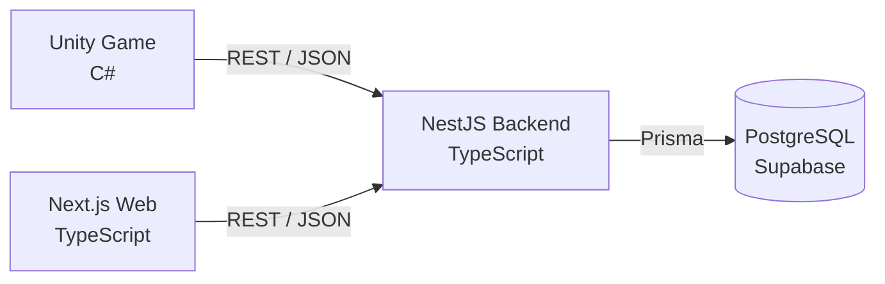

# Trickal Fan Game

> 트릭컬 IP 기반 2D 탑다운 로그라이크 팬게임과, 그 플레이 기록을 조회하는 전적·통계 웹 서비스

Unity로 만든 게임에서 한 판(Run)이 끝나면 결과가 REST API를 거쳐 PostgreSQL에 저장되고, Next.js 웹에서 유저 전적·통계·랭킹으로 조회됩니다. 게임 클라이언트부터 백엔드, 데이터베이스, 웹까지 1인으로 설계하고 구현한 프로젝트입니다.

| | |
|---|---|
| 개발 인원 | 1인 |
| 개발 기간 | 2026.08 ~ 진행 중 |
| 상태 | **개발 중** — 게임·API·웹은 로컬에서 끝까지 동작하며, 배포와 시연 영상은 아직 없습니다 ([진행 상황](#진행-상황)) |

<!-- TODO: 플레이 GIF와 웹 전적 화면 스크린샷 추가 -->

## 구성



게임과 웹은 데이터베이스에 직접 접근하지 않고 Backend API만 호출합니다. 요청 검증, 경험치 계산, 통계 집계는 모두 서버에서 처리합니다.

| 영역 | 기술 |
|---|---|
| Game | Unity 6.3 LTS (6000.3.22f1), C#, Input System, TextMeshPro |
| Backend | Node.js 24, NestJS 11, Prisma 7, class-validator, Jest |
| Database | PostgreSQL (Supabase), Prisma Migrate |
| Web | Next.js 16 (App Router), React 19, TypeScript, Vitest |
| 공통 | pnpm 11, Git LFS |

## 게임

캐릭터를 골라 3개 층을 탐색하고, 방마다 전투를 치르며 아이템으로 빌드를 만들어 층별 보스를 쓰러뜨리는 구조입니다.

- **절차적 층 생성** — Run seed에서 층별 seed를 파생해 격자형 방 그래프를 만듭니다. 같은 seed는 항상 같은 층을 만들고, 연결성·보스방 거리·필수 방 같은 불변조건을 검증한 뒤 실패하면 제한 횟수 안에서만 재시도합니다.
- **방 템플릿 18종** — Small·Basic·Wide·Tall·Large 다섯 크기와 장애물·구덩이 배치, 층별 보스방. 화면보다 큰 방에서만 카메라가 해당 축으로 움직입니다.
- **전투** — 추적형·원거리형·돌진형 일반 적과 변형, 웨이브 단위 Encounter, 층별 보스 3종(부스러기 · 새마음금고 · 크레용사용).
- **캐릭터 에르핀** — 기본 투사체 공격, 유도탄 4발을 쏘는 저학년 스킬, 조작 가능한 무적 돌진인 고학년 스킬.
- **아이템** — 등급과 스택이 있는 아티팩트, 한 칸을 공유하는 일회용 스펠·짱셈스펠, 일반·황금·다이아몬드 상자, 상점.
- **메타 성장** — Run 종료 경험치로 캐릭터 레벨이 오르고, 얻은 포인트로 스킬을 강화합니다. 계산과 저장은 서버가 맡습니다.

| 조작 | 키 |
|---|---|
| 이동 | `W` `A` `S` `D` |
| 공격 | 방향키 |
| 저학년 스킬 | `Space` |
| 고학년 스킬 | `Q` |
| 일시정지 | `Esc` |

## 웹

| 경로 | 내용 |
|---|---|
| `/search` | 닉네임 검색 |
| `/users/[nickname]` | 유저 요약, 플레이 기록 목록과 차트 |
| `/runs/[runId]` | Run 상세 — 캐릭터, 플레이 시간, 도달 층, 사망 원인, 아이템 획득 순서 |
| `/statistics` | 캐릭터·아이템·층별 통계 |
| `/rankings` | 최고 도달 층, 클리어 타임, 클리어 횟수 랭킹 |

## API

기본 경로는 `/api`입니다. 상세 계약은 [docs/07-api.md](docs/07-api.md)에 있습니다.

| Method | Path | 설명 |
|---|---|---|
| `POST` | `/users` | 로컬 플레이어 등록과 초기 캐릭터 진행 생성 |
| `GET` | `/users/search` | 닉네임 검색 |
| `GET` | `/users/:nickname` | 유저 프로필과 캐릭터 진행 |
| `GET` | `/users/:nickname/runs` | 유저의 Run 목록 (페이지네이션) |
| `PUT` | `/users/:nickname/characters/:characterId/skills/:skillType` | 스킬 강화 |
| `POST` | `/runs` | Run 결과 저장, 경험치 지급 |
| `GET` | `/runs/:runId` | Run 상세 |
| `GET` | `/statistics`, `/statistics/characters`, `/statistics/items`, `/statistics/floors`, `/statistics/users/:nickname` | 통계 |
| `GET` | `/rankings` | 랭킹 |
| `GET` | `/health`, `/health/ready` | 상태 확인 |

## 설계에서 신경 쓴 부분

**재전송해도 한 번만 저장되는 Run.** 게임은 네트워크 실패 시 같은 결과를 다시 보낼 수 있습니다. 클라이언트가 만든 `clientRunId`에 유니크 제약을 걸어, 같은 Run이 여러 번 도착해도 기록과 경험치·스킬 포인트가 한 번만 반영됩니다. 사용자 등록도 `clientProfileId`로 같은 방식을 씁니다.

**클라이언트를 믿지 않는 서버.** Unity가 보낸 값은 타입과 범위, 실제로 존재하는 캐릭터와 아이템인지를 서버에서 검증합니다. 경험치와 레벨은 클라이언트가 보내지 않고 서버가 Run 결과에서 계산합니다.

**생성 데이터와 Scene 객체의 분리.** 층 그래프(`GeneratedFloorGraph`)와 방별 진행 상태(`RoomRunState`)는 일반 C# 데이터이고, Prefab 인스턴스는 그 상태를 보여 주는 역할만 합니다. 방을 비활성화하거나 다시 만들어도 클리어·보상·상자 상태가 유지되어 재방문 시 중복 지급이 없습니다.

**결정적인 랜덤.** 층 구조, 방 템플릿, Encounter, 상자 내용물을 모두 seed에서 파생합니다. 프로세스마다 값이 달라지는 `GetHashCode()` 대신 직접 정의한 안정 해시를 쓰고, 그래프 생성과 콘텐츠 선택의 난수 흐름을 분리해 한쪽 변경이 다른 쪽 결과를 흔들지 않게 했습니다.

**Editor 검증기.** Scene·Prefab 구성은 재실행해도 중복이 생기지 않는 Editor Setup 코드로 만들고, 기능마다 불변조건을 확인하는 검증기를 메뉴로 실행합니다. 현재 검증기 130여 개가 있으며, 조건이 깨지면 예외로 실패합니다.

**계층 간 계약.** Item·Character ID는 한 번 정하면 의미를 바꾸지 않는 안정 키로 다룹니다. Backend 아이템 카탈로그의 ID와 효과 계약은 테스트로 고정하고, 더 이상 쓰지 않는 아이템도 과거 전적 표시를 위해 남겨 둡니다.

실제 빌드에서 겪은 문제와 원인 분석은 [트러블슈팅 기록](docs/troubleshooting/17-troubleshooting.md)에 정리했습니다.

## 진행 상황

| 단계 | 내용 | 상태 |
|---|---|---|
| Phase 0–3 | 설계, 게임 코어, Backend·DB, Unity → API → DB → Web 연결 | 완료 |
| Phase 4 | 3층 Run, 스킬, 랜덤 방 그래프, 아이템, 메타 성장 | 완료 |
| Phase 5–6 | 전적 검색 웹, 통계·랭킹 API, 차트 | 완료 |
| Phase 7 | Frontend·HUD, 방 템플릿, 층별 보스, 상자·스펠·상점 | 진행 중 |
| Phase 7 | 게임 빌드 배포, Backend·Web 배포 | 예정 |
| Phase 8 | 시연 영상, 회고 | 예정 |

지금은 상자, 일회용 스펠, 상점 경제를 다루는 [여섯째 달 계획](docs/21-sixth-month-plan.md)을 진행하고 있습니다. 전체 계획은 [로드맵](docs/02-roadmap.md)에 있습니다.

## 로컬 실행

Node.js 24, pnpm 11, Git LFS, Unity 6000.3.22f1, PostgreSQL 연결 문자열(Supabase 등)이 필요합니다.

```bash
git lfs install
git clone https://github.com/yeonguk0201/Trickal_FanGame.git
cd Trickal_FanGame

pnpm install            # 루트 도구
pnpm install:all        # backend, web 의존성

cp backend/.env.example backend/.env    # DATABASE_URL 입력
cp web/.env.example web/.env.local

pnpm --dir backend prisma:migrate:deploy
pnpm --dir backend prisma:seed

pnpm dev                # backend :3001, web :3000
```

게임은 Unity Hub에서 `game/` 폴더를 열고 `Assets/Scenes/FrontendScene.unity`에서 Play합니다. 기본 API 주소는 `http://localhost:3001/api`입니다.

| 명령어 | 설명 |
|---|---|
| `pnpm dev` | backend와 web 동시 실행 |
| `pnpm test` | backend Jest 테스트 |
| `pnpm --dir web test` | web Vitest 테스트 |
| `pnpm --dir web lint` | web lint |
| `pnpm db:studio` | Prisma Studio |

자세한 환경 구성은 [개발 환경 설정 가이드](docs/05-development-setup.md)를 참고합니다.

## 저장소 구조

```text
├── game/       Unity 프로젝트 (Assets/Scripts, Assets/Editor, Assets/Rooms …)
├── backend/    NestJS API, Prisma 스키마와 마이그레이션
├── web/        Next.js 전적·통계 웹
└── docs/       설계 문서, 월별 계획, 트러블슈팅
```

## 문서

| 문서 | 내용 |
|---|---|
| [00-project-overview](docs/00-project-overview.md) | 프로젝트 목적과 범위 |
| [03-game-design](docs/03-game-design.md) | 게임 규칙과 콘텐츠 |
| [04-architecture](docs/04-architecture.md) | 시스템 구조와 데이터 흐름 |
| [06-database](docs/06-database.md) | 데이터 모델 |
| [07-api](docs/07-api.md) | API 계약 |
| [08-project-structure](docs/08-project-structure.md) | 디렉터리와 책임 |
| [17-troubleshooting](docs/troubleshooting/17-troubleshooting.md) | 문제 해결 기록 |

## 저작권

트릭컬 리바이브(에피드게임즈)의 IP를 바탕으로 한 비상업적 팬 제작물이며, 에피드게임즈와 공식적인 관련이 없습니다. 원작의 캐릭터와 명칭에 대한 권리는 원저작권자에게 있습니다.
